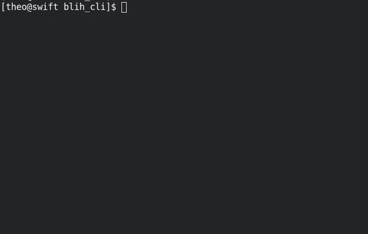

# Blih CLI
Blih CLI (say blikli) is the Blih (Bocal Lightweight Interface for Humans) Js CLI (Command-Line Interface) for linux env.



## Install & Setup
1. Install node https://nodejs.org/en/ (use `sudo apt-get node` for ubuntu or `sudo dnf install node` for fedora)
2. `git clone https://github.com/GreenDjango/blih_cli`
3. `sudo sh blih_cli/install.sh`
4. `rm -rf blih_cli/`
5. Enjoy with `blih_cli` !
6. Optional: add `alias my_name="blih_cli"` in .bashrc file

## Update
Use `blih_cli -u` for up to next **stable** version

Use `blih_cli --snapshot` for up  to  the next **snapshot** version.
This version can crash. Use only if you want to test the new features

## Help
Use `man blih_cli` for show help

## Uninstall
Use `blih_cli --uninstall` for uninstall blih_cli from 

---
## Dev
```
git clone https://github.com/GreenDjango/blih_cli
cd blih_cli
npm i
npm run build
./build/index.js
```
#### Lint
```
npm run lint
```
#### Build
```
npm run build
```

#### Production
```
npm run prod
```
